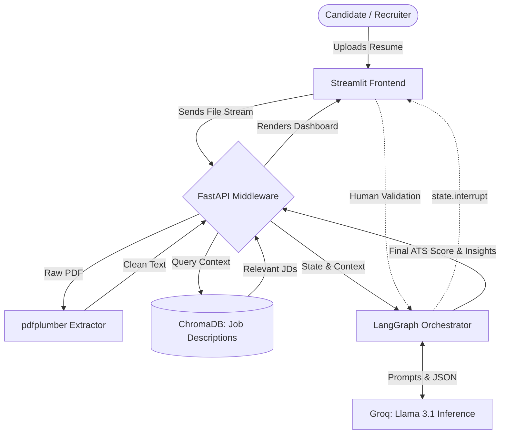
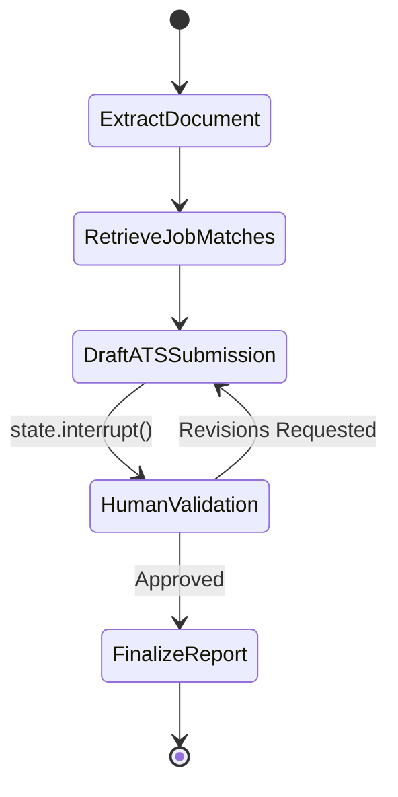

# 🚀 CareerBridge AI

**AI-Powered Candidate Placement & Profile Optimization Engine**

## 📖 System Overview

CareerBridge AI is an advanced agentic workflow designed to bridge the gap between candidate resumes and technical job descriptions. By utilizing large language models and multi-agent state machines, the system intelligently parses complex documents, evaluates candidate profiles against a curated vector database of job requirements, and generates actionable ATS scoring.

To guarantee accuracy and eliminate AI hallucination, the system features a strict **Human-in-the-Loop (HITL)** architecture, pausing the workflow for human validation before finalizing any placement decisions.

---

## ✨ Core Architecture & Features

* **Deterministic Document Extraction:** Utilizes `pdfplumber` to accurately strip raw text from complex, multi-column PDF resumes. It deterministically reads document streams without tearing text blocks or scrambling formatting.
* **RAG-Powered Job Matching:** An in-memory `ChromaDB` vector store seeded with curated, high-fidelity technical Job Descriptions. This allows the AI to perfectly match candidate skills to precise role requirements.
* **Sub-Second AI Inference:** Powered by Groq's API, executing open-source models (`Llama 3.1 8B` / `Qwen 2.5 7B`) to provide instantaneous ATS evaluation and structured JSON data generation.
* **Agentic Orchestration (HITL):** Built on `LangGraph`, our multi-agent state machines route the data pipeline and utilize `state.interrupt()` hooks. This pauses the AI agent mid-thought, returning control to the frontend so a human can review, edit, or approve the output.
* **Interactive UI/UX:** A clean `Streamlit` frontend handles drag-and-drop file uploads, chat interactions, and the human validation dashboard.

---

## 🧠 System Architecture Diagram

---

## 🔄 LangGraph HITL State Machine

---

## 🛠️ Technical Stack

| Layer | Technology | Purpose |
| --- | --- | --- |
| **Frontend UI** | Streamlit | Renders web dashboard, file uploads, and HITL controls. |
| **Cloud Hosting (UI)** | Streamlit Community Cloud | Continuous deployment from GitHub. |
| **Backend Engine** | FastAPI (Python) | Central router managing data, streaming, and requests. |
| **Cloud Hosting (API)** | Render | Persistent hosting for core business logic. |
| **Data Extraction** | `pdfplumber` | Layout-aware, deterministic text extraction from PDFs. |
| **Vector Store (RAG)** | ChromaDB | In-memory storage for rapid semantic job matching. |
| **AI Inference** | Groq API | Sub-second execution of Llama 3.1 / Qwen 2.5. |
| **Agent Orchestration** | LangChain & LangGraph | Multi-agent state machines and human validation hooks. |
